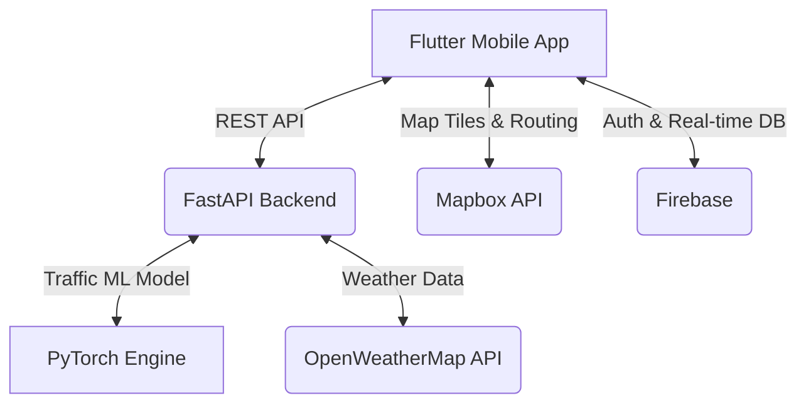

<div align="center">
  
  <h1>Traffica</h1>
  <p><strong>Real-Time Traffic & Delivery Management System</strong></p>

  [](https://flutter.dev/)
  [](https://fastapi.tiangolo.com/)
  [](https://www.python.org/)
  [](LICENSE)
</div>

---

## Project Overview

**Traffica** is a comprehensive logistics and routing application featuring real-time traffic prediction, delivery management, and route optimization. Built with a robust **Python FastAPI backend** and a cross-platform **Flutter mobile application**, Traffica empowers drivers and fleet managers to navigate efficiently, avoid congestion, and ensure timely deliveries using advanced Machine Learning algorithms.

## Features

### Intelligent Routing & Backend (FastAPI)
- **Hybrid Route Algorithms**: Combines Bellman-Ford (handles negative weights) + A* (heuristic-based) for mathematically optimal pathfinding.
- **Real-Time Traffic Prediction**: Utilizes PyTorch ML models for accurate congestion forecasting based on historical and real-time data.
- **Weather-Aware Routing**: Integrates OpenWeatherMap to dynamically adjust routes during adverse weather conditions.
- **Fleet Management**: Real-time vehicle tracking, status monitoring, and driver analytics.

### Cross-Platform Frontend (Flutter)
- **Interactive Map Visualization**: Seamless Mapbox GL integration with custom routing layers.
- **Real-Time Navigation**: Turn-by-turn directions, dynamic re-routing, and live traffic overlays.
- **Location Services & Geocoding**: Background GPS tracking, smooth animations, and robust permission handling.
- **Community Reporting**: Users can report roadblocks, hazards, and traffic incidents in real-time.

## Architecture



## Tech Stack

| Domain | Technologies |
|---|---|
| **Frontend** | Flutter 3.x (Dart), Provider, FL Chart, Mapbox GL, Firebase |
| **Backend** | Python 3.8+, FastAPI, Uvicorn, PyTorch, NumPy |
| **Integrations** | Mapbox (Maps & Routing), OpenWeatherMap (Weather), Firebase (Auth & Storage) |

## Project Structure

```text
Mini_project/
├── backend/                      # Python FastAPI Backend
│   ├── app/
│   │   ├── main.py              # FastAPI application & endpoints
│   │   ├── algorithms.py        # Hybrid routing algorithms
│   │   └── models.py            # Pydantic data models
│   └── requirements.txt         # Python dependencies
│
└── traffica/                    # Flutter Mobile App
    ├── lib/
    │   ├── models/             # Data models
    │   ├── services/           # API services, location, navigation
    │   └── screens/            # UI screens
    ├── android/                # Android configuration
    ├── ios/                    # iOS configuration
    └── pubspec.yaml           # Flutter dependencies
```

## Setup Instructions

### Prerequisites
- Python 3.8+
- Flutter SDK 3.x
- API Keys: Mapbox Access Token, Firebase Configuration.

### 1. Backend Setup (FastAPI)

```bash
cd backend
python -m venv venv

# Activate Virtual Environment
# Windows:
venv\Scripts\activate
# Linux/Mac:
source venv/bin/activate

pip install -r requirements.txt
```

**Environment Variables (`backend/.env`):**
Create a `.env` file in the `backend/` directory if you intend to add backend API keys (optional).

**Run the Server:**
```bash
uvicorn app.main:app --reload
```

### 2. Frontend Setup (Flutter)

```bash
cd traffica
flutter pub get
```

**Environment Variables (`traffica/.env`):**
Create a `.env` file in the `traffica/` root directory and add your Mapbox token:
```env
MAPBOX_ACCESS_TOKEN=your_mapbox_access_token_here
```
*(Note: Never commit your `.env` files or API keys to version control.)*

**Run the App:**
```bash
flutter run
```

## API Documentation

The backend API is fully documented and automatically generated by FastAPI. Once the backend server is running, navigate to:
- **Swagger UI**: `http://localhost:8000/docs`
- **ReDoc**: `http://localhost:8000/redoc`

## Platform Support

Traffica is built on Flutter and designed to be cross-platform:
- **Android**: Supported (Android 5.0+)
- **iOS**: Supported (iOS 11.0+)
- **Web**: Supported (Chrome, Firefox, Safari, Edge)
- **Desktop**: Experimental support for Windows and macOS

## Future Enhancements
- Expanded ML models for more granular congestion prediction.
- Real-time video stream analysis from dashcams.
- Offline routing capabilities.
- Advanced driver gamification and rewards system.

## 🎥 Demo

https://youtu.be/qVu_xn_gpIk
---
*Designed & Developed for Modern Logistics.*
